<!--
  Manual for Cognate Bitcrush. Partially auto-generated.
  AUTO blocks are regenerated by tools/manuals/build_manual.py.
  To preserve hand-edited content, REMOVE the surrounding AUTO markers.
-->

<!-- AUTO:meta -->
---
plugin: "cognate-bitcrush"
display_name: "Cognate Bitcrush"
version: "1.10"
date: "06/04/2026"
category: "Overdrive & Distortion"
block_image: images/block.png
---
<!-- /AUTO -->

# Cognate Bitcrush

<!-- AUTO:at-a-glance -->
| | |
|---|---|
| **Category** | Overdrive & Distortion |
| **Channels** | Mono in / mono out |
| **Version** | 1.10 (06/04/2026) |
<!-- /AUTO -->

## Overview

<!-- AUTO:overview -->
Cognate Bitcrush is a gritty, lo-fi sculptor for everything from clean 8-bit nostalgia to full digital destruction. It pairs the two classic ingredients — sample-rate reduction and bit-depth reduction — with a unique **Blocks** mode that re-imagines JPEG-style lossy artefacts as a bass effect, plus a tilt EQ, blend control, and a menu of stranger digital glitches that twist the bits and bytes in ways you won't have heard from a normal crusher. Drop the rate to chase aliasing and 80s sampler crunch; drop the bits for gated digi-fuzz; crank Blocks for cleaner sci-fi crunch; or sweep the lot with the envelope follower and LFO for movement and growl.
<!-- /AUTO -->

## Use cases

<!-- AUTO:use-cases -->
- **Robotic synth bass.** Stack after an octaver to turn your bass into a chiptune lead.
- **Sizzle on top of overdrive.** Run after distortion or fuzz to add a brittle, aliased upper edge.
- **80s retro delays.** Place before a delay to give repeats a degraded, sample-and-hold character.
- **Pitch-shifter sparkle.** A crystal-like high-end sheen that masks the artefacts of bass pitch shifting.
- **Expression-pedal sweeps.** Patch an expression pedal to **Rate** for swept aliasing — a hands-free way to ride the effect from clean to ruined.
- **Dynamic growl.** Use **Env** to tie sample rate to your picking force — soft notes stay clean, hard notes break up.
- **Blocks crunch.** A cleaner, more controlled grit than bit reduction — useful when you want lo-fi character without losing definition.
- **Glitch one-shots.** Set **Glitch** to *Bytebeat*, *Tear* or *Hard Sync* for sound-design textures over a sustained note.
<!-- /AUTO -->

## Parameters

<!-- AUTO:param-pages -->
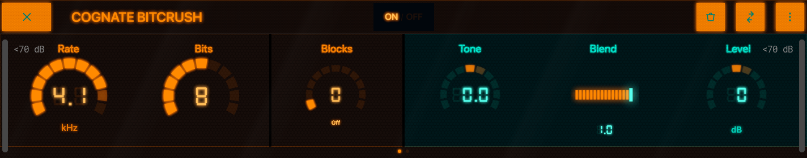

*Page 1 of 2*

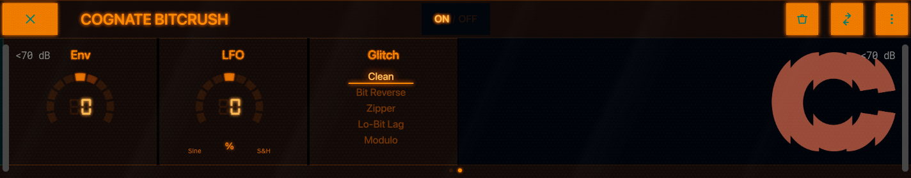

*Page 2 of 2*
<!-- /AUTO -->

### Bypass

<!-- AUTO:param-bypass-spec -->

- **Type:** Toggle in the centre of the top bar
<!-- /AUTO -->

<!-- AUTO:param-bypass-prose -->
Turns off the bit-crushing and passes your bass's signal directly through to the next block in the signal chain. The plugin stays in your preset so you can switch the effect in and out without re-loading anything.
<!-- /AUTO -->

### Sample Rate

<!-- AUTO:param-rate-spec -->
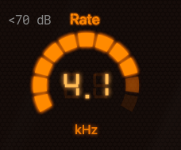

- **Range:** 100 to 10000 Hz
- **Default:** 4000 Hz
<!-- /AUTO -->

<!-- AUTO:param-rate-prose -->
Sets the sample rate the plugin downsamples your bass to. Lower values fold high frequencies back as audible aliasing — the same trick that gave 80s samplers their distinctive crunchy distortion. At the top of the range it's nearly transparent; in the middle you get warm, gritty character; near the bottom it disintegrates into bright metallic noise. This is the most expressive control on the plugin — assign it to an expression pedal and sweep from clean to ruin.
<!-- /AUTO -->

### Bits

<!-- AUTO:param-bits-spec -->
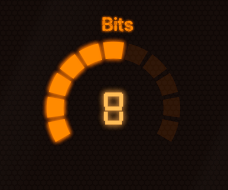

- **Range:** 1 to 16
- **Default:** 8
<!-- /AUTO -->

<!-- AUTO:param-bits-prose -->
Reduces the bit depth the bass is quantised to. At 16 bits it's clean; as you drop, quiet detail starts to step rather than slide, and the bass takes on a gritty, gated character. Below about 4 bits it becomes a digi-fuzz — the quietest part of every note clamps to silence and only the loudest peaks make it through. Pairs especially well with **Rate** at low values for a full vintage-sampler sound.
<!-- /AUTO -->

### Blocks

<!-- AUTO:param-block_size-spec -->
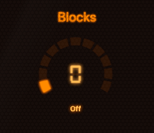

- **Range:** 0 to 128
- **Default:** 0
- **Special:** `0` = "Off"
<!-- /AUTO -->

<!-- AUTO:param-block_size-prose -->
A unique third destruction mode, inspired by the way JPEG compression artefacts blocky-ify a low-bitrate image. Instead of stepping the signal in time (Rate) or amplitude (Bits), Blocks groups samples into blocks and processes them as units, producing a cleaner, more controlled crunch with a sci-fi edge. Setting Blocks to **Off** (0) disables it. As you crank it up the artefacts become broader and more rhythmic — useful when you want lo-fi character without giving up note definition.
<!-- /AUTO -->

### Tone

<!-- AUTO:param-tone-spec -->
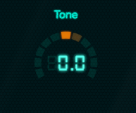

- **Range:** -1 to 1
- **Default:** 0
<!-- /AUTO -->

<!-- AUTO:param-tone-prose -->
A tilt EQ that shapes the *distortion* coming out of the crusher. At **0** it's flat. Turn **negative** to roll off the brittle top end and emphasise low-mid grit (better for stacking onto an already-bright signal). Turn **positive** to brighten and add the metallic sparkle that bit-crushed bass is loved for. Tilt EQs are gentle and musical — they let you change the colour of the artefacts without scooping the bass underneath.
<!-- /AUTO -->

### Blend

<!-- AUTO:param-blend-spec -->
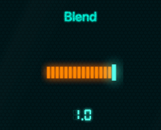

- **Range:** 0 to 1
- **Default:** 1
<!-- /AUTO -->

<!-- AUTO:param-blend-prose -->
Mixes the crushed signal against your dry bass. At **1.0** you hear the effect alone — full devastation. Pull it back and the dry bass underpins everything, with the crusher acting as an upper layer of crisp, brittle edge. A common setting for a usable lead-bass tone is around 0.3–0.5: enough crushed signal to add character without losing the body of the note.
<!-- /AUTO -->

### Level

<!-- AUTO:param-level-spec -->
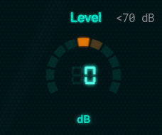

- **Range:** -12 to 12 dB
- **Default:** 0 dB
<!-- /AUTO -->

<!-- AUTO:param-level-prose -->
Output trim. Bit-crushing changes perceived loudness — heavy crushing can make a signal feel quieter even though peaks are higher, and very mild settings can push the output hot. Use Level to match the bypassed and engaged volumes so kicking the effect on doesn't jump the mix.
<!-- /AUTO -->

### Env

<!-- AUTO:param-env-spec -->
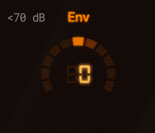

- **Range:** -1 to 1
- **Default:** 0
<!-- /AUTO -->

<!-- AUTO:param-env-prose -->
An envelope-follower modulation that ties the **Sample Rate** to the dynamics of your playing.

- **Positive** values raise the rate as you play harder — soft notes stay grittier, hard notes clean up.
- **Negative** values do the opposite — soft notes sit clean and hard notes break up into aliased growls and zappy, laser-like accents.
- At **0** the rate is static and unresponsive to playing.

Negative settings are where the fun is: dig in for a harder note and the bit-crusher snarls back at you.
<!-- /AUTO -->

### LFO

<!-- AUTO:param-lfo-spec -->
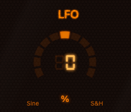

- **Range:** -100 to 100 %
- **Default:** 0 %
<!-- /AUTO -->

<!-- AUTO:param-lfo-prose -->
A low-frequency modulation that sweeps the **Sample Rate** automatically. Bipolar — positive values use a smooth sine, negative values use a stepped random pattern. At **0** the LFO is off. Small amounts add gentle movement and stop the crusher sounding static; larger amounts produce obvious wobble (sine) or unpredictable digital chatter (random). Useful for sustained notes that would otherwise feel mechanical.
<!-- /AUTO -->

### Glitch

<!-- AUTO:param-glitch-spec -->
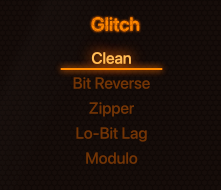

- **Options:** Clean, Bit Reverse, Zipper, Lo-Bit Lag, Modulo, Hard Sync, Tear, Bytebeat, Cross Bits
<!-- /AUTO -->

<!-- AUTO:param-glitch-prose -->
A menu of digital glitches layered on top of the basic Rate/Bits/Blocks crushing. Each one twists the bits and bytes in a different unconventional way that interacts with your bass signal — they're not subtle.

- **Clean** — No glitch. The plain crusher sound.
- **Bit Reverse** — Reverses the order of bits within each sample, scrambling amplitudes into unexpected values. Sounds like a malfunctioning DAC.
- **Zipper** — Steps the signal in coarse jumps, producing the audible "zipper" noise of a low-resolution parameter sweep.
- **Lo-Bit Lag** — Holds samples for longer at lower bit settings, exaggerating the gating character of bit reduction.
- **Modulo** — Wraps sample values around a small range, folding loud notes back through zero. Aggressive and harmonically rich.
- **Hard Sync** — Forces the signal to reset on a fixed period, creating the buzzy, fixed-pitch overtone of an analogue hard-sync oscillator.
- **Tear** — Rips chunks of samples from elsewhere in the signal and stitches them in, like a buffer underrun.
- **Bytebeat** — Borrows tricks from the bytebeat tradition: arithmetic operations on raw sample bytes that produce alien, music-adjacent textures.
- **Cross Bits** — Cross-wires bits between adjacent samples for a strange, lurching artefact pattern.

These are sound-design tools more than tone shapers — pick one, hold a note, and explore.
<!-- /AUTO -->
