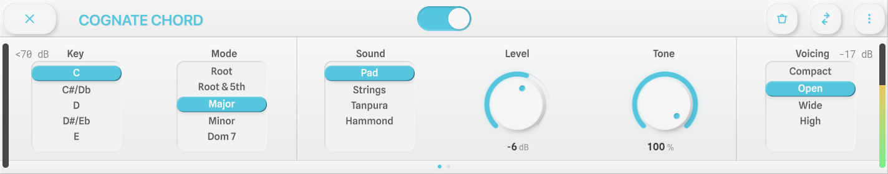
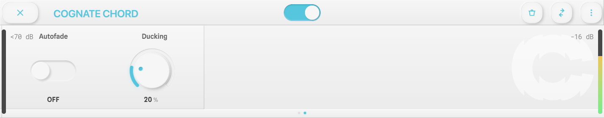
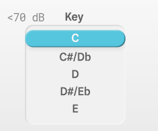
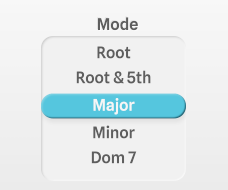
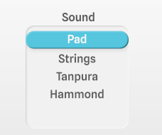
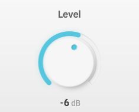
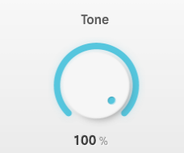
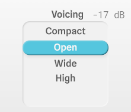
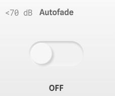
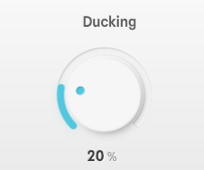

<!--
  Manual for Cognate Chord. Partially auto-generated.
  AUTO blocks are regenerated by tools/manuals/build_manual.py.
  To preserve hand-edited content, REMOVE the surrounding AUTO markers.
-->

<!-- AUTO:meta -->
---
plugin: "cognate-chord"
display_name: "Cognate Chord"
version: "1.01"
date: "06/04/2026"
category: "Utilities"
block_image: images/block.png
---
<!-- /AUTO -->

# Cognate Chord

<!-- AUTO:at-a-glance -->
| | |
|---|---|
| **Category** | Utilities |
| **Channels** | Stereo in / stereo out (sum-to-mono on Anagram — see note) |
| **Version** | 1.01 (06/04/2026) |
<!-- /AUTO -->

## Overview

<!-- AUTO:overview -->
Cognate Chord is a chord reference and practice companion. Dial in a key and a chord type and it holds the harmony for you, using one of four beautiful sustained voices — synth pad, strings, tanpura drone, or Hammond organ. **Autofade** brings the chord in when you start playing and fades it out when you stop; **Ducking** pulls it under your notes so it meets your line in waves rather than fighting it. Pair it with Cognate Metro for a complete no-fuss practice rig.
<!-- /AUTO -->

## Use cases

<!-- AUTO:use-cases -->
- **Locking in chord tones.** Hear which notes belong over a chord instead of guessing.
- **Scales and modes in context.** Run a mode over its parent chord so you actually hear the colour of each degree.
- **Ear training.** Use it as a reliable harmonic reference to sing or play intervals against.
- **Fretless and double bass intonation work.** A sustained drone or pad is a brutally honest tuning check.
- **Hands-free progressions.** Assign two different chords to Anagram footswitches to move between them without stopping playing.
- **Practice rig.** Pair with Cognate Metro — click plus changing chord — for a full no-laptop practice session.
<!-- /AUTO -->

## Parameters

<!-- AUTO:param-pages -->

*Page 1 of 2*

*Page 2 of 2*
<!-- /AUTO -->

### Bypass

<!-- AUTO:param-bypass-spec -->

- **Type:** Toggle in the centre of the top bar
<!-- /AUTO -->

<!-- AUTO:param-bypass-prose -->
Silences the chord and passes your bass straight through to the next block in the signal chain. The plugin stays in your preset, so you can toggle the chord in and out without having to reload anything.
<!-- /AUTO -->

### Key

<!-- AUTO:param-key-spec -->

- **Options:** C, D, E, F, G, A, B
<!-- /AUTO -->

<!-- AUTO:param-key-prose -->
Selects the root note of the chord. Combine with **Mode** to build a complete chord — e.g. Key **A** + Mode **Minor 7** gives you Am7. Covers all seven natural notes; for sharps and flats, pick the nearest and re-voice with the chord type (e.g. F# minor = F# but you can also think of it as D major's relative minor).
<!-- /AUTO -->

### Mode

<!-- AUTO:param-mode-spec -->

- **Options:** Root, Root & 5th, Major, Minor, Dom 7, Major 7, Minor 7, Sus 4, m7b5, Dim 7, Aug, MinMaj 7
<!-- /AUTO -->

<!-- AUTO:param-mode-prose -->
Chord quality, from a bare root note up to altered jazz chords. Covers everything you're likely to reach for in pop, rock, and jazz practice.

- **Root** — Single note, the tonic. Useful as a drone or for intonation.
- **Root & 5th** — Open fifth, no third. Modal, ambiguous, works over both major and minor scales.
- **Major / Minor** — Standard triads.
- **Dom 7, Major 7, Minor 7** — The three essential seventh chords of functional harmony.
- **Sus 4** — The third replaced by the fourth; bright and unresolved.
- **m7♭5** (half-diminished) — The ii° of a minor key, and the darker half of a minor II-V.
- **Dim 7** — Symmetrical diminished seventh. Tense.
- **Aug** — Augmented triad. Whole-tone flavour.
- **MinMaj 7** — Minor with a major seventh. Moody, film-score colour.
<!-- /AUTO -->

### Sound

<!-- AUTO:param-sound-spec -->

- **Options:** Pad, Strings, Tanpura, Hammond
<!-- /AUTO -->

<!-- AUTO:param-sound-prose -->
The voice used to play the chord. Each one has subtle internal movement so it stays interesting across long practice sessions.

- **Pad** — Warm synth pad. Neutral and blends under anything.
- **Strings** — Bowed ensemble. More melodic character; good for slower work.
- **Tanpura** — Plucked drone in the Indian classical tradition. Rich with overtones — excellent for intonation practice.
- **Hammond** — Tonewheel organ. Brighter and more rhythmic; gives the chord a sense of forward motion.
<!-- /AUTO -->

### Level

<!-- AUTO:param-level-spec -->

- **Range:** -40 to 20 dB
- **Default:** -6 dB
- **Special:** `-40` = "-Inf"
<!-- /AUTO -->

<!-- AUTO:param-level-prose -->
Volume of the chord, relative to your bass. Set it loud enough to hear clearly but quiet enough that your own playing still dominates. Turning fully down (`-Inf`) silences the chord without disabling the plugin.
<!-- /AUTO -->

### Tone

<!-- AUTO:param-tone-spec -->

- **Range:** 0 to 100 %
- **Default:** 100 %
<!-- /AUTO -->

<!-- AUTO:param-tone-prose -->
Brightness of the chord sound. Full up is the voice as intended — warm but present. Roll it back to tuck the chord further into the background, useful when the Pad or Tanpura are already feeling too rich under your line.
<!-- /AUTO -->

### Voicing

<!-- AUTO:param-voicing-spec -->

- **Options:** Compact, Open, Wide, High
<!-- /AUTO -->

<!-- AUTO:param-voicing-prose -->
How the chord is distributed across octaves. Pick the voicing that best gets out of the way of the register you're playing in.

- **Compact** — Close-position chord in one octave. Clean and tight.
- **Open** — Same notes spread across a wider register, less dense.
- **Wide** — Two octaves. Bigger sound, good for sparse playing.
- **High** — Pushes the chord up into the upper register to clear space for bass-register playing. Best for working out of the low fretboard.
<!-- /AUTO -->

### Autofade

<!-- AUTO:param-autofade-spec -->

- **Type:** On / Off
<!-- /AUTO -->

<!-- AUTO:param-autofade-prose -->
When on, the chord fades in when you start playing and fades out again when you stop. Makes the chord feel like an accompanist that knows when to join in and when to pause, instead of a constant drone. Turn it off to hear the chord continuously — useful for extended intonation work or when you need an unbroken harmonic reference.
<!-- /AUTO -->

### Ducking

<!-- AUTO:param-ducking-spec -->

- **Range:** 0 to 100 %
- **Default:** 20 %
<!-- /AUTO -->

<!-- AUTO:param-ducking-prose -->
How much the chord drops in volume while you're playing. At **0%** the chord holds its full level regardless; as you increase, the chord sidechains out of your way and returns as soon as you pause. A setting around **20%** (the default) is enough to stop the chord crowding your notes without burying it. Paired with Autofade, the chord rises and falls in natural waves around your playing.
<!-- /AUTO -->
