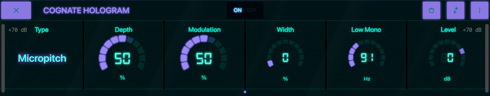
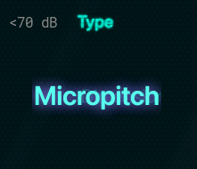
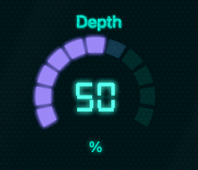
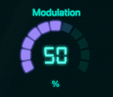
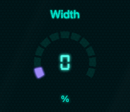
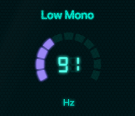
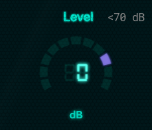

<!--
  Manual for Cognate Hologram. Partially auto-generated.
  AUTO blocks are regenerated by tools/manuals/build_manual.py.
  To preserve hand-edited content, REMOVE the surrounding AUTO markers.
-->

<!-- AUTO:meta -->
---
plugin: "cognate-hologram"
display_name: "Cognate Hologram"
version: "1.01"
date: "06/04/2026"
category: "Modulation & Pitch"
block_image: images/block.png
---
<!-- /AUTO -->

# Cognate Hologram

<!-- AUTO:at-a-glance -->
| | |
|---|---|
| **Category** | Modulation & Pitch |
| **Channels** | Stereo in / stereo out (sum-to-mono on Anagram — see note) |
| **Version** | 1.01 (06/04/2026) |
<!-- /AUTO -->

## Overview

<!-- AUTO:overview -->
Cognate Hologram is a stereo spatialiser built specifically for bass. It takes a mono signal and gives it width and movement without losing the low-end solidity that makes bass sit in a mix. Four classic mono-to-stereo methods cover a range of characters, from subtle studio shimmer to lush synth-style unison; **Low Mono** anchors fundamentals in the centre so nothing wanders, and every mode collapses cleanly to mono with no phase cancellation or disappearing frequencies. Go beyond chorus. Still bass.
<!-- /AUTO -->

## Use cases

<!-- AUTO:use-cases -->
- **Studio-double thickness.** *Micropitch* for the classic doubled-bass sound used on a thousand records.
- **Synth-lead density.** *Hyper* for a dense unison stack when bass is carrying the top line.
- **Room-filling solo tones.** *Dimension* or *Doubler* to turn a clean DI into a wide, 3D sound without flange artefacts.
- **Chorus-replacement.** Where a traditional chorus would wash out the fundamental, Hologram keeps the low end anchored.
- **Live stereo rig.** Drive a stereo backline or in-ear mix with genuine stereo bass without losing punch.
- **Final shine on a preset.** Low *Depth*, low *Modulation*, a touch of *Width* — a subtle wide-and-alive finish that doesn't announce itself.
<!-- /AUTO -->

## Parameters

<!-- AUTO:param-pages -->

*Full panel layout*
<!-- /AUTO -->

### Bypass

<!-- AUTO:param-bypass-spec -->

- **Type:** Toggle in the centre of the top bar
<!-- /AUTO -->

<!-- AUTO:param-bypass-prose -->
Turns off the spatialiser and passes your bass straight through mono. Use it to A/B the effect against the dry signal, or to silence the processing between songs without removing Hologram from your preset.
<!-- /AUTO -->

### Type

<!-- AUTO:param-type-spec -->

- **Options:** Micropitch, Dimension, Hyper, Doubler
<!-- /AUTO -->

<!-- AUTO:param-type-prose -->
Selects the underlying mono-to-stereo algorithm. Each one has a distinct character — start here and use **Depth** and **Modulation** to tune the flavour.

- **Micropitch** — Fine pitch shifting combined with short delays. The classic studio-doubling sound: thick, solid, vintage.
- **Dimension** — Homage to the Roland SDD-320 Dimension D. Lush, stable stereo spread without obvious wobble. The most "mixed-record" sound in the plugin.
- **Hyper** — Stacked unison voices in the style of a modern Serum-style supersaw. Dense and synth-like.
- **Doubler** — Flanger-derived doubling inspired by the MXR Model 126. Organic and BBD-coloured, with a slight analogue width movement.
<!-- /AUTO -->

### Depth

<!-- AUTO:param-depth-spec -->

- **Range:** 0 to 100 %
- **Default:** 50 %
<!-- /AUTO -->

<!-- AUTO:param-depth-prose -->
How much of the effect you're hearing. At low settings it's a gentle wideness around the dry signal; at the top it's the effect in full. Every mode stays usable across the full range — crank it without worrying about phase-wrecking the low end.
<!-- /AUTO -->

### Modulation

<!-- AUTO:param-modulation-spec -->

- **Range:** 0 to 100 %
- **Default:** 50 %
<!-- /AUTO -->

<!-- AUTO:param-modulation-prose -->
Controls how much internal movement the effect has — the amount of slow pitch or delay modulation inside the selected **Type**. Low settings are still and glassy; higher settings add organic motion and depth. Sweet spot is usually around the default; beyond that you start to hear the modulation as obvious wobble, which is sometimes the point.
<!-- /AUTO -->

### Width

<!-- AUTO:param-width-spec -->

- **Range:** 0 to 100 %
- **Default:** 0 %
<!-- /AUTO -->

<!-- AUTO:param-width-prose -->
A carefully tuned mid/side enhancer applied after the main effect, for when you need the stereo image to go further than the algorithm alone provides. At **0%** the image is what the selected **Type** produces natively; as you increase, the side information is boosted relative to the mid, exaggerating the spread. Still mono-compatible at any setting.
<!-- /AUTO -->

### Low Mono

<!-- AUTO:param-lowMono-spec -->

- **Range:** 50 to 500 Hz
- **Default:** 90 Hz
<!-- /AUTO -->

<!-- AUTO:param-lowMono-prose -->
Frequencies below this point are kept mono — they aren't widened, modulated, or stereo-enhanced. This is the trick that makes Hologram usable on bass: the fundamentals and body of every note stay rock-solid in the centre of the image, while only the harmonics get the stereo treatment. The default sits just above a typical low-B fundamental. Move it higher if the effect is still affecting the feel of your low end; move it lower for more wideness on deep notes at the cost of some image stability.
<!-- /AUTO -->

### Level

<!-- AUTO:param-level-spec -->

- **Range:** -40 to 12 dB
- **Default:** 0 dB
<!-- /AUTO -->

<!-- AUTO:param-level-prose -->
Output trim. Most of the Type + Depth combinations don't shift perceived loudness much, but turning Depth up can add a small amount of output energy — use Level to match the bypassed and engaged volumes.
<!-- /AUTO -->
