<!--
  Manual for Cognate Kinetic. Partially auto-generated.
  AUTO blocks are regenerated by tools/manuals/build_manual.py.
  To preserve hand-edited content, REMOVE the surrounding AUTO markers.
-->

<!-- AUTO:meta -->
---
plugin: "cognate-kinetic"
display_name: "Cognate Kinetic"
version: "1.10"
date: "06/04/2026"
category: "EQs, Filters and Dynamics"
block_image: images/block.png
---
<!-- /AUTO -->

# Cognate Kinetic

<!-- AUTO:at-a-glance -->
| | |
|---|---|
| **Category** | EQs, Filters and Dynamics |
| **Channels** | Mono in / mono out |
| **Version** | 1.10 (06/04/2026) |
<!-- /AUTO -->

## Overview

<!-- AUTO:overview -->
Cognate Kinetic is an envelope filter that works with you, not against you. It handles classic downward and upward funky and synthy sweeps with intelligent auto-sensitivity quietly solving the usual envelope-filter problem in the background: too sensitive in one room, unresponsive in the next, never the same twice. Kinetic stays predictable regardless of input level or playing dynamics, while still rewarding you when you dig in. Two filter circuits (multimode OTA and Moog ladder) cover everything from silky warm movement to tearing laser resonance, with drive, blend, and an LFO for when you want to go further.
<!-- /AUTO -->

## Use cases

<!-- AUTO:use-cases -->
- **Classic downward envelope funk.** Negative **Range**, mid Speed, Low Pass — the Bootsy sound out of the box.
- **Upward synth-style sweeps.** Positive **Range** with resonance up for a Mutron-meets-Moog growl on top of each note.
- **Resonant auto-wah.** Band Pass filter type with high Resonance turns every note into a spoken "wow".
- **Auto-wah for slow ballads.** LFO in place of the envelope for hands-free movement that isn't playing-dependent.
- **Dubstep wub.** Fast LFO, heavy resonance, Ladder filter, high Drive.
- **Random robot bleeps.** Negative LFO value switches to sample & hold — unpredictable stepped movement.
- **Ladder bite.** Switch to Ladder for that unmistakable Moog resonant peak.
- **Consistent onstage dynamics.** Trust the auto-sensitivity to follow you from a quiet bridge into a loud chorus without re-tuning the knob mid-song.
<!-- /AUTO -->

## Parameters

<!-- AUTO:param-pages -->
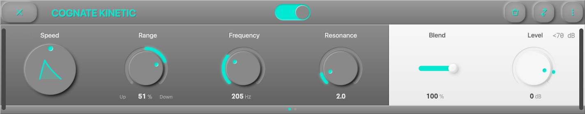

*Page 1 of 2*

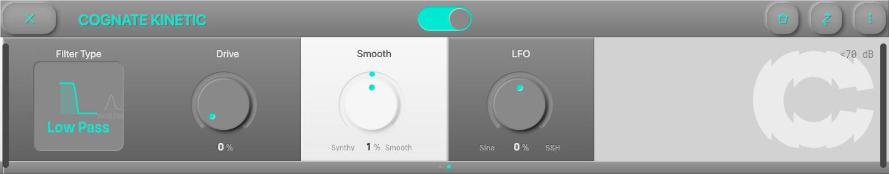

*Page 2 of 2*
<!-- /AUTO -->

### Bypass

<!-- AUTO:param-bypass-spec -->

- **Type:** Toggle in the centre of the top bar
<!-- /AUTO -->

<!-- AUTO:param-bypass-prose -->
Turns off the envelope filter and passes your bass straight through to the next block. The plugin stays in your preset, so you can kick Kinetic in and out without reloading anything.
<!-- /AUTO -->

### Speed

<!-- AUTO:param-speed-spec -->
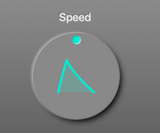

- **Range:** 0 to 1
- **Default:** 0.5
<!-- /AUTO -->

<!-- AUTO:param-speed-prose -->
Morphs the envelope's character from smooth and flowing to snappy and zappy. At low settings the filter opens and closes gradually, following the broad shape of each note; at the top the envelope is sharp and instant, giving each note a fast transient "wow" that's great for percussive playing. Think of it as the single knob that separates *funk* from *synth*.
<!-- /AUTO -->

### Up/Down Range

<!-- AUTO:param-range-spec -->
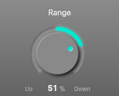

- **Range:** -100 to 100 %
- **Default:** 50 %
<!-- /AUTO -->

<!-- AUTO:param-range-prose -->
Direction and depth of the envelope sweep, in a single bipolar knob.

- **Negative values** — Downward filter: playing harder pulls the cutoff **down** from the base **Frequency**. Classic funk territory.
- **Positive values** — Upward filter: playing harder pushes the cutoff **up**. Synth-style opening.
- **0** — No envelope modulation; the filter just sits at **Frequency**.

The magnitude controls how much the filter moves — small values for subtle dynamics, full values for dramatic sweeps.
<!-- /AUTO -->

### Frequency

<!-- AUTO:param-frequency-spec -->
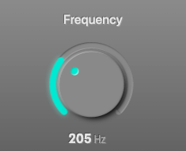

- **Range:** 50 to 5000 Hz
- **Default:** 200 Hz
<!-- /AUTO -->

<!-- AUTO:param-frequency-prose -->
The base cutoff frequency of the filter — where it sits when the envelope isn't doing anything. Set this to the centre of where you want the sweep to live: **Range** moves the cutoff up or down from here. The default (200 Hz) puts you in classic low-mid funk territory; higher values shift the action into synth/wah territory.
<!-- /AUTO -->

### Resonance

<!-- AUTO:param-resonance-spec -->
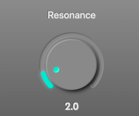

- **Range:** 0.5 to 15
- **Default:** 2
<!-- /AUTO -->

<!-- AUTO:param-resonance-prose -->
Emphasis at the filter cutoff. At low values the filter is gentle and transparent; push it up and a resonant peak develops around the cutoff, adding a vocal "wow" on downward sweeps and a laser-like bite on upward ones. On the **Ladder** filter type, high resonance starts to self-oscillate — the filter rings like a sine wave at the cutoff — which is the classic Moog sound. Back off if individual notes start feeding back on themselves.
<!-- /AUTO -->

### Mix

<!-- AUTO:param-mix-spec -->
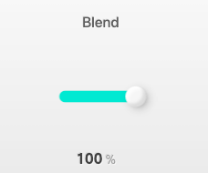

- **Range:** 0 to 100 %
- **Default:** 100 %
<!-- /AUTO -->

<!-- AUTO:param-mix-prose -->
Wet/dry blend. At **100%** you hear only the filtered signal; as you pull it back, the dry bass returns under the effect. Useful for keeping some low-end solidity under a heavy resonant setting — the dry carries the fundamentals while the wet layer adds the movement on top.
<!-- /AUTO -->

### Level

<!-- AUTO:param-level-spec -->
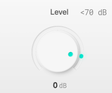

- **Range:** -40 to 6 dB
- **Default:** 0 dB
<!-- /AUTO -->

<!-- AUTO:param-level-prose -->
Output trim. High resonance and heavy drive can push the output loud, especially on sweeps that hit the cutoff peak — use Level to match the bypassed and engaged volumes so engaging the effect doesn't jump the mix.
<!-- /AUTO -->

### Filter Type

<!-- AUTO:param-filter_type-spec -->
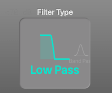

- **Options:** Low Pass, Band Pass, High Pass, Ladder
<!-- /AUTO -->

<!-- AUTO:param-filter_type-prose -->
Two filter designs, four modes.

- **Low Pass** — OTA-style low-pass: warm, musical, the default funk-filter shape. Frequencies above the cutoff are rolled off, leaving the low end and whatever sits below the cutoff.
- **Band Pass** — OTA-style band-pass: a narrow window that moves around the cutoff. The most vocal, wah-like option.
- **High Pass** — OTA-style high-pass: rolls off everything below the cutoff. Upward-sweep heaven — ripped, thin, synth-y.
- **Ladder** — Moog Minimoog ladder filter (low-pass). Unmistakable resonant bite and saturation; the character most associated with classic synth bass. Pair with high Resonance and Drive for a Minimoog-on-a-pedalboard sound.
<!-- /AUTO -->

### Drive

<!-- AUTO:param-drive-spec -->
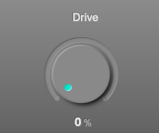

- **Range:** 0 to 100 %
- **Default:** 0 %
<!-- /AUTO -->

<!-- AUTO:param-drive-prose -->
Saturation in the filter path. At **0%** the filter is clean; as you push it, harmonics start to pile up on top of the filtered signal, giving each sweep a thicker, more aggressive tone. The OTA filters get warm and gritty; the Ladder filter develops that classic Moog overdrive. A little drive adds body; a lot turns Kinetic into a full synth-bass voice.
<!-- /AUTO -->

### Smooth

<!-- AUTO:param-smooth-spec -->
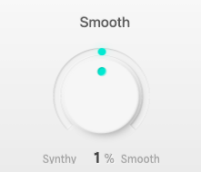

- **Range:** -100 to 100 %
- **Default:** 0 %
<!-- /AUTO -->

<!-- AUTO:param-smooth-prose -->
Bipolar shaping of the envelope's attack and release times around whatever **Speed** sets.

- **Positive values** make the movement smoother and more rounded — the filter glides in and out for a silky, almost auto-wah-like response.
- **Negative values** sharpen the envelope — attack and release get snappier, pushing toward a zipper-edged, synth-stab feel.
- **0** is neutral, using the Speed setting as-is.

Use this when Speed alone isn't quite getting the feel right — it's the second axis of envelope shaping.
<!-- /AUTO -->

### LFO

<!-- AUTO:param-lfo-spec -->
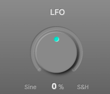

- **Range:** -100 to 100 %
- **Default:** 0 %
<!-- /AUTO -->

<!-- AUTO:param-lfo-prose -->
An extra low-frequency oscillator layered on top of the envelope, for when you want movement that isn't tied to your playing dynamics. Bipolar:

- **Positive values** — Smooth sine modulation. Gentle auto-wah for ballads; faster rates get into wub territory.
- **Negative values** — Stepped sample & hold. Random-seeming jumps between filter positions — useful for robot-bleep and glitch textures.
- **0** — Off.

Works with the envelope, not instead of it: both modulations add to the filter cutoff, so you can combine dynamic response *and* automatic movement.
<!-- /AUTO -->
