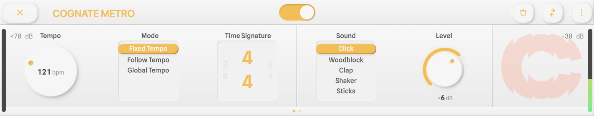
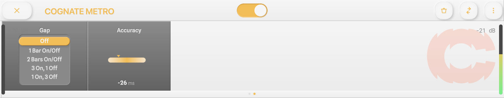
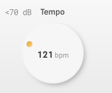
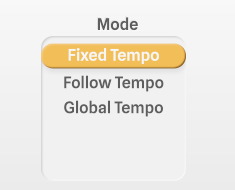
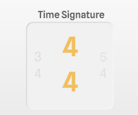
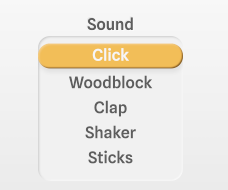
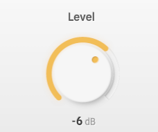
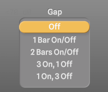
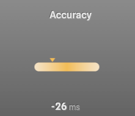

<!--
  Manual for Cognate Metro. Partially auto-generated.
  AUTO blocks are regenerated by tools/manuals/build_manual.py.
  To preserve hand-edited content, REMOVE the surrounding AUTO markers.
-->

<!-- AUTO:meta -->
---
plugin: "cognate-metro"
display_name: "Cognate Metro"
version: "1.01"
date: "06/04/2026"
category: "Utilities"
block_image: images/block.png
---
<!-- /AUTO -->

# Cognate Metro

<!-- AUTO:at-a-glance -->
| | |
|---|---|
| **Category** | Utilities |
| **Channels** | Mono in / mono out |
| **Version** | 1.01 (06/04/2026) |
<!-- /AUTO -->

## Overview

<!-- AUTO:overview -->
Cognate Metro is a free metronome block for the Darkglass Anagram, designed to help you practice and improve your internal sense of time. It covers all the basics — bass-friendly click sounds, common and irregular time signatures, and tempo control by direct entry, host sync, tap, or by simply playing a few notes on your bass. Beyond the basics, it includes two features aimed squarely at building rhythmic skill: **Gap mode**, which progressively strips beats and bars out of the click so you have to hold the pulse yourself, and **Accuracy**, a readout that tells you how far ahead or behind the beat you actually are.
<!-- /AUTO -->

## Use cases

<!-- AUTO:use-cases -->
- **Live click track.** A clean, bass-friendly metronome for in-ear monitoring on stage.
- **Pacing a song from slow to tempo.** Start under tempo and work up gradually as the part becomes comfortable.
- **Building internal time.** Use Gap mode to wean yourself off a constant click — the goal isn't to play *with* the metronome but to *be* the metronome.
- **Diagnosing rush and drag.** Watch the Accuracy readout while you play to see whether you're consistently ahead or behind, and by how much.
- **Practising odd metres.** 5/4, 7/4 and the compound 6/8, 9/8, 12/8 patterns are built in.
- **Tempo discovery.** Got a riff but no idea what BPM it is? Switch to Follow Tempo and play — Cognate Metro locks on to you.
<!-- /AUTO -->

## Parameters

<!-- AUTO:param-pages -->

*Page 1 of 2*

*Page 2 of 2*
<!-- /AUTO -->

### Bypass

<!-- AUTO:param-bypass-spec -->

- **Type:** Toggle in the centre of the top bar
<!-- /AUTO -->

<!-- AUTO:param-bypass-prose -->
Turns off the metronome click and passes your bass's signal directly through to the next block in the signal chain. Use it to silence the click between songs without removing Metro from your preset, or to A/B the click against silence while you check your timing on your own.
<!-- /AUTO -->

### Tempo

<!-- AUTO:param-tempo-spec -->

- **Range:** 0 to 500 BPM
- **Default:** 120 BPM
- **Special:** `0` = "Listening"
<!-- /AUTO -->

<!-- AUTO:param-tempo-prose -->
Sets the click tempo in beats per minute when **Mode** is set to *Fixed Tempo*. The full range covers everything from very slow practice tempos up to drum-and-bass and gabber territory.

Setting Tempo to **0** puts the plugin into **Listening** mode: no click is produced, but the tempo display still tracks whatever you play. Useful for checking the tempo of an idea without committing to an audible click.
<!-- /AUTO -->

### Mode

<!-- AUTO:param-mode-spec -->

- **Options:** Fixed Tempo, Follow Tempo, Global Tempo
<!-- /AUTO -->

<!-- AUTO:param-mode-prose -->
Selects how the metronome decides on its tempo.

- **Fixed Tempo** — The click follows the **Tempo** parameter. The standard "set the dial and play" mode.
- **Follow Tempo** — Cognate Metro listens to your bass and locks onto whatever tempo you play. Strum a few notes in time and the click falls in with you. A faster, hands-free alternative to tap tempo.
- **Global Tempo** — The click follows Anagram's global tempo, so it stays in sync with other tempo-aware blocks (delays, modulation, etc.) and any external tempo source the device is using.
<!-- /AUTO -->

### Time Signature

<!-- AUTO:param-time_signature-spec -->

- **Options:** 2/4, 3/4, 4/4, 5/4, 7/4, 6/8, 9/8, 12/8
<!-- /AUTO -->

<!-- AUTO:param-time_signature-prose -->
Sets the metre of the click. The first beat of each bar is accented so you can hear the bar boundary.

- **2/4, 3/4, 4/4** — Standard simple metres.
- **5/4, 7/4** — Asymmetric metres for odd-time practice.
- **6/8, 9/8, 12/8** — Compound metres, with the beat felt as dotted-quarter groupings.
<!-- /AUTO -->

### Sound

<!-- AUTO:param-sound-spec -->

- **Options:** Click, Woodblock, Clap, Shaker, Sticks
<!-- /AUTO -->

<!-- AUTO:param-sound-prose -->
Selects the click sample. Each option is voiced to sit clearly above bass without masking the low end you're trying to play.

- **Click** — A neutral, percussive click. The default if in doubt.
- **Woodblock** — Warm, rounded attack — easier on the ears for long sessions.
- **Clap** — Broadband, cuts through a busy mix.
- **Shaker** — Softer transient; useful for ballads or anywhere a hard click would be intrusive.
- **Sticks** — Sharp, dry, similar to a drumstick rim click.
<!-- /AUTO -->

### Level

<!-- AUTO:param-level-spec -->

- **Range:** -40 to 12 dB
- **Default:** -6 dB
- **Special:** `-40` = "-Inf"
<!-- /AUTO -->

<!-- AUTO:param-level-prose -->
Output level of the click. Set it relative to your bass signal — high enough to play to comfortably, low enough not to fatigue you over a long session. Turning fully down (`-Inf`) silences the click without disabling the plugin, which is useful for the Gap mode practice trick of muting the metronome at will.
<!-- /AUTO -->

### Gap Mode

<!-- AUTO:param-gap_mode-spec -->

- **Options:** Off, 1 Bar On/Off, 2 Bars On/Off, 3 On, 1 Off, 1 On, 3 Off, 4 Bars On/Off, Beat 1 Only, Beats 1 & 3, Beats 2 & 4, Random 30%, Random 60%, Random 90%
<!-- /AUTO -->

<!-- AUTO:param-gap_mode-prose -->
Removes part of the click on a repeating pattern, forcing you to hold the pulse internally during the gaps. This is the heart of Cognate Metro's practice philosophy: a metronome that's always playing teaches you to follow it, but a metronome that comes and goes teaches you to *be* it.

- **Off** — A normal, continuous click.
- **1 Bar On/Off, 2 Bars On/Off, 4 Bars On/Off** — Alternates whole bars of click and silence in increasing lengths. Start at 1 bar and work up — 4 bars on/off is genuinely difficult.
- **3 On, 1 Off** — Three bars of click, one bar of silence. A gentler ratio for getting started.
- **1 On, 3 Off** — One bar of click then three bars of silence. The opposite extreme: a check-in beat every four bars.
- **Beat 1 Only** — Only the downbeat of each bar plays. Forces you to feel the subdivisions yourself.
- **Beats 1 & 3 / Beats 2 & 4** — Half the beats in each bar. *Beats 2 & 4* is the classic backbeat-only practice; harder than it sounds.
- **Random 30% / 60% / 90%** — Each click has the given probability of *being dropped*. Random 30% removes nearly a third of the clicks; Random 90% removes almost all of them. The unpredictability prevents you from learning the pattern.

After any gap, the click returns and you can immediately hear whether you drifted.
<!-- /AUTO -->

### Accuracy

<!-- AUTO:param-accuracy-spec -->

- **Type:** Readout (set by the plugin, not user-controlled)
- **Range:** -50 to 50 ms
- **Default:** 0 ms
<!-- /AUTO -->

<!-- AUTO:param-accuracy-prose -->
A readout, not a control. Cognate Metro listens to your bass while you play along with the click and reports your timing offset relative to the beat in milliseconds. **Negative** values mean you're playing *ahead* of the beat (rushing); **positive** values mean you're *behind* (dragging). The display averages over recent notes so it doesn't jitter on every hit.

This is the kind of feedback that's almost impossible to get from listening alone — most players have a consistent bias they can't hear. Watch the readout while you play and you'll find out which side of the beat you live on.
<!-- /AUTO -->
