<!--
  Manual for Cognate Pultrick. Partially auto-generated.
  AUTO blocks are regenerated by tools/manuals/build_manual.py.
  To preserve hand-edited content, REMOVE the surrounding AUTO markers.
-->

<!-- AUTO:meta -->
---
plugin: "cognate-pultrick"
display_name: "Cognate Pultrick"
version: "1.01"
date: "06/04/2026"
category: "EQs, Filters & Dynamics"
block_image: images/block.png
---
<!-- /AUTO -->

# Cognate Pultrick

<!-- AUTO:at-a-glance -->
| | |
|---|---|
| **Category** | EQs, Filters & Dynamics |
| **Channels** | Mono in / mono out |
| **Version** | 1.01 (06/04/2026) |
<!-- /AUTO -->

## Overview

<!-- AUTO:overview -->
Cognate Pultrick is a faithful model of the EQ1-P circuit — valve warmth, transformer iron, and the famous boost-cut trick that's been quietly shaping great bass tone for sixty years. Boost and cut the same low frequency at the same time and something unexpected happens: a complex, interactive response that tightens and fattens at once, in a way no conventional EQ can replicate. Pultrick captures the full circuit — not just the EQ curves, but the component interactions, the valve saturation, and the iron transformer that gives the real thing its low-end grip and top-end air.
<!-- /AUTO -->

## Use cases

<!-- AUTO:use-cases -->
- **The Pultec low-end trick.** Pick a low frequency, then push **Low Boost** and **Low Atten** at the same time. The interaction adds weight and tightens the bottom simultaneously — the move studio engineers have used since the 1960s.
- **Tightening a flabby low end.** Low frequency at 60 Hz, modest boost, more atten — pulls the mud out without losing fundamental.
- **Adding air without harshness.** High band at 8–10 kHz with **High Boost**, gentle **Bandwidth** — opens up presence and pick attack without the brittleness of a digital shelf.
- **Mastering the tone of a clean DI.** Always-on, gently set: a touch of low-end fatness, a small high-end lift, and the transformer model on top.
- **Driving the input.** Push the boosts hard for slight valve and transformer saturation in addition to the EQ shape.
- **Anchor on a pedalboard.** Functions as the tonal "voice" of a preset that other effects sit on top of.
<!-- /AUTO -->

## Parameters

<!-- AUTO:param-pages -->
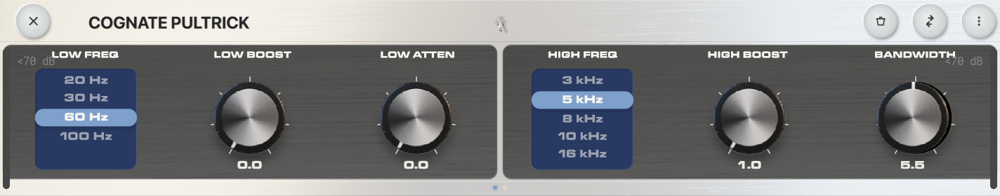

*Page 1 of 2*

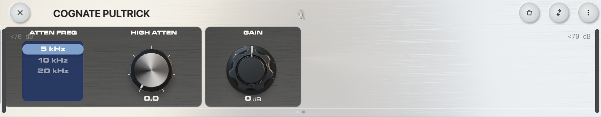

*Page 2 of 2*
<!-- /AUTO -->

### Bypass

<!-- AUTO:param-bypass-spec -->

- **Type:** Toggle in the centre of the top bar
<!-- /AUTO -->

<!-- AUTO:param-bypass-prose -->
Turns off the EQ and passes your bass straight through, including the modelled valve and transformer stages. Use it to A/B Pultrick against the dry signal — even with all the EQ controls at zero, the circuit colour is still in the path when the plugin is active.
<!-- /AUTO -->

### Low Freq

<!-- AUTO:param-lf_freq-spec -->
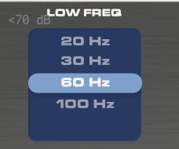

- **Options:** 20 Hz, 30 Hz, 60 Hz, 100 Hz
<!-- /AUTO -->

<!-- AUTO:param-lf_freq-prose -->
The low-band centre frequency. Pick the option that sits where you want to *feel* the action, then use **Low Boost** and **Low Atten** to shape it.

- **20 Hz** — Sub. Mostly felt rather than heard; the territory of low-B fundamentals.
- **30 Hz** — Deep low end. Adds weight and rumble.
- **60 Hz** — Body. The most musical setting for the boost-cut trick — fattens without flapping.
- **100 Hz** — Low mids. Where notes get their punch and definition.
<!-- /AUTO -->

### Low Boost

<!-- AUTO:param-lf_boost-spec -->
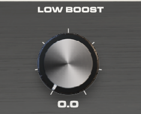

- **Range:** 0 to 10
- **Default:** 0
<!-- /AUTO -->

<!-- AUTO:param-lf_boost-prose -->
Boost amount at the **Low Freq** centre. On its own this is a gentle low-shelf-like lift. Where it gets interesting is when **Low Atten** is also up: the two together create a complex, asymmetric curve that pushes the low end forward while pulling out the muddy region just above it. That's the Pultec trick — and it sounds quite different from any conventional EQ doing the same thing.
<!-- /AUTO -->

### Low Atten

<!-- AUTO:param-lf_atten-spec -->
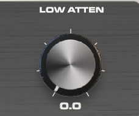

- **Range:** 0 to 10
- **Default:** 0
<!-- /AUTO -->

<!-- AUTO:param-lf_atten-prose -->
Cut amount at the **Low Freq** centre. The cut sits at a slightly higher frequency than the boost — the original designers' "mistake" that turned the EQ into something interactive. Use it on its own to clean up mud, or alongside **Low Boost** for the famous boost-and-cut trick. Push both for the iconic Pultec low-end shape.
<!-- /AUTO -->

### High Freq

<!-- AUTO:param-hf_freq-spec -->
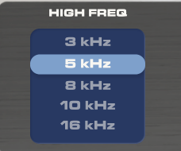

- **Options:** 3 kHz, 5 kHz, 8 kHz, 10 kHz, 16 kHz
<!-- /AUTO -->

<!-- AUTO:param-hf_freq-prose -->
The high-band centre frequency for the boost. This is a peaking filter — the lift sits at this frequency with the width set by **Bandwidth**.

- **3 kHz** — Upper-mid presence. Good for cutting through a dense mix.
- **5 kHz** — Pick attack and string detail.
- **8 kHz** — The classic Pultec "air" frequency. Adds sheen without harshness.
- **10 kHz** — Brighter, glassier high end.
- **16 kHz** — Open top — feel rather than a specific frequency you can point at.
<!-- /AUTO -->

### High Boost

<!-- AUTO:param-hf_boost-spec -->
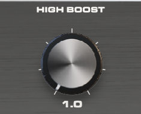

- **Range:** 0 to 10
- **Default:** 0
<!-- /AUTO -->

<!-- AUTO:param-hf_boost-prose -->
Boost amount at the selected **High Freq**. The Pultec high band has a famously musical character — push it harder than you would on a normal EQ; it stays sweet rather than turning brittle. Pair with **Bandwidth** to control how broad or focused the lift is.
<!-- /AUTO -->

### Bandwidth

<!-- AUTO:param-bandwidth-spec -->
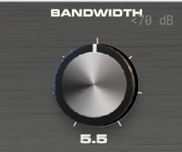

- **Range:** 0 to 10
- **Default:** 5
<!-- /AUTO -->

<!-- AUTO:param-bandwidth-prose -->
The Q (width) of the high-frequency boost peak. Low values make the boost narrow and surgical — useful for picking out a specific harmonic. High values make it broad and gentle, the way most engineers actually use a Pultec for high-end air. The default sits in the middle.
<!-- /AUTO -->

### Atten Freq

<!-- AUTO:param-hf_atten_freq-spec -->
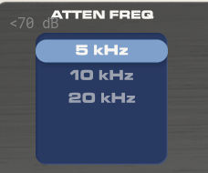

- **Options:** 5 kHz, 10 kHz, 20 kHz
<!-- /AUTO -->

<!-- AUTO:param-hf_atten_freq-prose -->
Centre frequency for the high-frequency *cut*, separate from the boost frequency. Lets you boost at one high frequency and cut at another — useful for adding sheen at 8 kHz while taming harshness at 5 kHz, for example.

- **5 kHz** — Tame upper-mid bite or pick noise.
- **10 kHz** — General brightness reduction.
- **20 kHz** — Roll off the very top edge — feel-only adjustment.
<!-- /AUTO -->

### High Atten

<!-- AUTO:param-hf_atten-spec -->
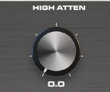

- **Range:** 0 to 10
- **Default:** 0
<!-- /AUTO -->

<!-- AUTO:param-hf_atten-prose -->
Cut amount at the **Atten Freq**. Use it to roll off harshness without affecting the air added by the boost band. The Pultec high-cut is gentle and broad — closer to a tilt than a notch — so it sounds natural even at heavy settings.
<!-- /AUTO -->

### Gain

<!-- AUTO:param-gain-spec -->
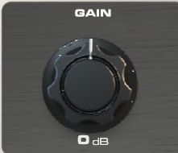

- **Range:** -12 to 12 dB
- **Default:** 0 dB
<!-- /AUTO -->

<!-- AUTO:param-gain-prose -->
Output level. EQ moves change perceived loudness — use Gain to match the bypassed and engaged volumes so engaging Pultrick is a tonal change, not a level jump. Pushing this hot also drives the modelled output stage a little harder, adding subtle saturation if you want it.
<!-- /AUTO -->
