<!--
  Manual for Cognate Ringmod. Partially auto-generated.
  AUTO blocks are regenerated by tools/manuals/build_manual.py.
  To preserve hand-edited content, REMOVE the surrounding AUTO markers.
-->

<!-- AUTO:meta -->
---
plugin: "cognate-ringmod"
display_name: "Cognate Ringmod"
version: "1.10"
date: "06/04/2026"
category: "Modulation & Pitch"
block_image: images/block.png
---
<!-- /AUTO -->

# Cognate Ringmod

<!-- AUTO:at-a-glance -->
| | |
|---|---|
| **Category** | Modulation & Pitch |
| **Channels** | Mono in / mono out |
| **Version** | 1.10 (06/04/2026) |
<!-- /AUTO -->

## Overview

<!-- AUTO:overview -->
Cognate Ringmod is ring modulation at its most playful — and most controlled. At its core it's a classic ringmod: a carrier oscillator multiplied against your bass, with drive to push it into rougher territory. The **Sidebands** control opens it up further, morphing continuously between lower-sideband frequency shifting, full ring modulation, and upper sideband — everything from subtle pitch displacement to full metallic clang. An expressive envelope section ties the carrier to your playing dynamics; **Tracking** locks the carrier to your bass's pitch for harmonised intervals from an octave down to three octaves up. Stars falling, doom bells, sci-fi aliens, EDM growls — and a surprisingly fat octaver — all in one block.
<!-- /AUTO -->

## Use cases

<!-- AUTO:use-cases -->
- **Metallic clangs and bells.** Mid-range carrier, full ring mod (Sidebands at 0), high Blend.
- **Fat octaver.** Turn **Tracking** on, set **Interval** to -12 (octave down) or +12 (octave up), Sine waveform — a surprisingly clean and fat octaver.
- **Sci-fi laser zaps.** High Drive, Square waveform, **Env Amount** positive — hit harder for more carrier sweep.
- **Doom bells.** Slow envelope, deep Drive, low carrier frequency, partial Blend.
- **Subtle pitch displacement.** Sidebands near zero (but not quite), low carrier frequency — adds a chorus-like detune that isn't a chorus.
- **Tremolo without tremolo.** Sub-audio Frequency (under 20 Hz), Sine waveform — rhythmic amplitude modulation.
- **Pseudo-phasing.** Very slow Frequency, asymmetric blend.
- **Stars-falling textures.** Random LFO direction with high carrier — twinkling, glassy, generative.
- **EDM growls.** Tracking on, Interval at +7 or +12, fast LFO — dubstep harmoniser.
<!-- /AUTO -->

## Parameters

<!-- AUTO:param-pages -->
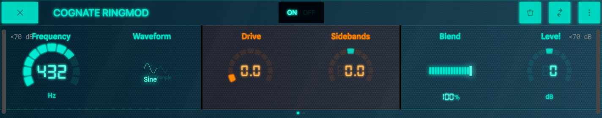

*Page 1 of 2*

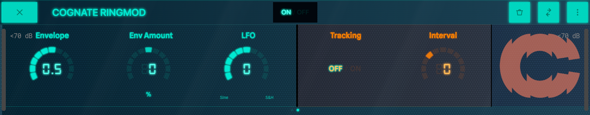

*Page 2 of 2*
<!-- /AUTO -->

### Bypass

<!-- AUTO:param-bypass-spec -->

- **Type:** Toggle in the centre of the top bar
<!-- /AUTO -->

<!-- AUTO:param-bypass-prose -->
Turns off the ring modulator and passes your bass straight through. The plugin stays in your preset, so you can switch the effect in and out without reloading anything.
<!-- /AUTO -->

### Frequency

<!-- AUTO:param-frequency-spec -->
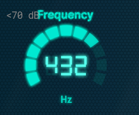

- **Range:** 0.5 to 20000 Hz
- **Default:** 440 Hz
<!-- /AUTO -->

<!-- AUTO:param-frequency-prose -->
The carrier oscillator's frequency. The whole character of the effect depends on this:

- **Sub-audio (below ~20 Hz)** — The ringmod becomes amplitude modulation: tremolo and pseudo-phaser textures.
- **Low audio (20–200 Hz)** — Detuning, beating, and metallic shimmer that interacts with your fundamentals.
- **Mid (200 Hz–2 kHz)** — Classic ringmod territory: bells, robots, sci-fi clangs.
- **High (2 kHz+)** — Bright, glassy, glitchy artefacts on top of the bass.

When **Tracking** is on, this control is overridden in favour of **Interval**.
<!-- /AUTO -->

### Waveform

<!-- AUTO:param-waveform-spec -->
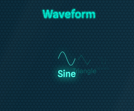

- **Options:** Sine, Triangle, Square, Saw
<!-- /AUTO -->

<!-- AUTO:param-waveform-prose -->
Shape of the carrier oscillator. Each waveform produces a different harmonic interaction with your bass.

- **Sine** — Pure tone, fewest sidebands. The cleanest, most musical ringmod sound; the right choice for octaver and harmoniser duty when **Tracking** is on.
- **Triangle** — Sine with a touch of grit; subtly more present than pure sine.
- **Square** — Heavy with odd harmonics. Buzzy, aggressive, the classic harsh ringmod tone.
- **Saw** — Full harmonic spectrum, the most chaotic and richest texture. For sound design and noise.
<!-- /AUTO -->

### Drive

<!-- AUTO:param-drive-spec -->
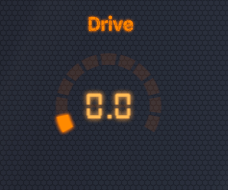

- **Range:** 0 to 1
- **Default:** 0
<!-- /AUTO -->

<!-- AUTO:param-drive-prose -->
Saturation in front of the modulator. At **0** the multiplication is clean — every artefact is purely the carrier × bass interaction. As you push it, the bass is driven harder before being modulated, generating extra harmonics that interact with the carrier and produce a denser, rougher, more aggressive output. Goes from polite ringmod to full digi-noise across the range.
<!-- /AUTO -->

### Sidebands

<!-- AUTO:param-sidebands-spec -->
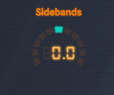

- **Range:** -1 to 1
- **Default:** 0
<!-- /AUTO -->

<!-- AUTO:param-sidebands-prose -->
Continuously morphs between three modes of operation, all in one knob.

- **-1.0** — Pure **lower-sideband frequency shifter**. Shifts the bass *down* by the carrier frequency, in a non-harmonic way (different from a pitch shifter). Subtle pitch displacement at low carrier frequencies; alien at higher ones.
- **0** — Classic **ring modulation**. Both sidebands present — sum and difference frequencies of carrier and bass. Bells, clangs, robots.
- **+1.0** — Pure **upper-sideband frequency shifter**. Shifts the bass *up*. Bright, glassy, often used for sci-fi effects.

Anywhere in between is a smooth blend. Try mid-positive values for a slightly displaced shimmer over the dry-ish bass.
<!-- /AUTO -->

### Blend

<!-- AUTO:param-blend-spec -->
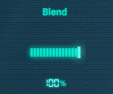

- **Range:** 0 to 100 %
- **Default:** 100 %
<!-- /AUTO -->

<!-- AUTO:param-blend-prose -->
Mixes the modulated signal against the dry bass. At **100%** you only hear the effect; pull it back to keep the dry bass underneath as a foundation for the modulated layer to sit on. For extreme settings (Square waveform, high Drive) blending in some dry signal is often what makes the result musically usable.
<!-- /AUTO -->

### Level

<!-- AUTO:param-level-spec -->
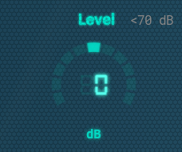

- **Range:** -12 to 12 dB
- **Default:** 0 dB
<!-- /AUTO -->

<!-- AUTO:param-level-prose -->
Output trim. Heavy ring modulation can change perceived loudness in unpredictable ways — use Level to match the bypassed and engaged volumes so kicking the effect on isn't a level surprise.
<!-- /AUTO -->

### Envelope

<!-- AUTO:param-envelope-spec -->
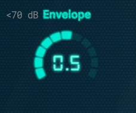

- **Range:** 0 to 1
- **Default:** 0.5
<!-- /AUTO -->

<!-- AUTO:param-envelope-prose -->
Shapes the *speed* of the envelope follower that responds to your playing. Low values give a slow, smooth envelope — the effect breathes with the contour of each note; high values are snappy and zappy, locking onto each pick attack. Pair with **Env Amount** to set how much the envelope actually moves the carrier.
<!-- /AUTO -->

### Env Amount

<!-- AUTO:param-env_amount-spec -->
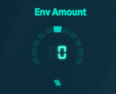

- **Range:** -100 to 100 %
- **Default:** 0 %
<!-- /AUTO -->

<!-- AUTO:param-env_amount-prose -->
How much — and in which direction — your playing dynamics push the carrier frequency. Bipolar:

- **Positive** — Harder playing pushes the carrier *up*, brightening the modulation as you dig in.
- **Negative** — Harder playing pushes the carrier *down*, getting darker and more aggressive on louder notes.
- **0** — No envelope modulation; the carrier sits at **Frequency**.

Use this to make Ringmod react to your touch instead of just sitting there: hit harder for more, ease off for clean.
<!-- /AUTO -->

### LFO

<!-- AUTO:param-lfo-spec -->
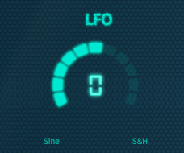

- **Range:** -100 to 100
- **Default:** 0
<!-- /AUTO -->

<!-- AUTO:param-lfo-prose -->
A single-knob LFO that adds automatic movement to the carrier frequency. Bipolar:

- **Positive** — Smooth sine modulation. Wobble, vibrato, dubstep wub depending on rate.
- **Negative** — Sample & hold (random stepped). Robotic, glitchy, generative textures — great for "stars falling" sounds with high carrier frequencies.
- **0** — Off.

Combines additively with the envelope, so you can have both touch-responsive *and* automatic movement at once.
<!-- /AUTO -->

### Tracking

<!-- AUTO:param-tracking-spec -->
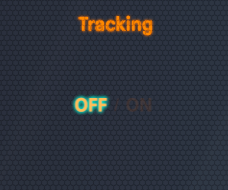

- **Type:** On / Off
<!-- /AUTO -->

<!-- AUTO:param-tracking-prose -->
When on, Ringmod listens to your bass's pitch and locks the carrier oscillator to follow it. **Frequency** is overridden; **Interval** sets the harmonic relationship between the carrier and your fundamental. This is what turns the plugin into a harmoniser or octaver — every note generates its own carrier at the chosen interval, so the modulation result is always musically related to what you're playing.
<!-- /AUTO -->

### Interval

<!-- AUTO:param-interval-spec -->
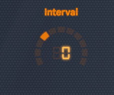

- **Range:** -12 to 36
- **Default:** 0
<!-- /AUTO -->

<!-- AUTO:param-interval-prose -->
The interval between your bass note and the tracked carrier, in semitones. Only active when **Tracking** is on. Ranges from an octave below (-12) to three octaves above (+36).

- **-12** — Octave down. With Sine waveform and full Blend, a fat, clean octaver.
- **0** — Carrier matches the fundamental — produces a harmonic-rich doubling of the same note.
- **+7** — Perfect fifth above. Power-chord harmoniser.
- **+12 / +24** — One or two octaves up. Bright synth-octaver textures.
- **+36** — Three octaves up. Glassy, sparkly upper-register sheen.

Try non-octave intervals (like +5 or +14) for more dissonant, sci-fi harmonisations.
<!-- /AUTO -->
